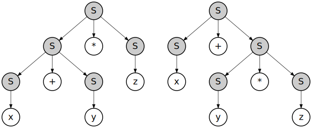

<p align='center'>
    
</p>

<p align="center">
    
    
</p>

<br>

Language: <a href="readme.md">EN-US</a>

Here are my studies and experiments using ANTLR4 (for language analysis). The target code in this case is in C++, and for this a base project is used, which can be found here:

- https://github.com/melchisedech333/antlr4-demonstration-project

Just download the project and leave it in the same directory with the experiments.

<b>Note:</b> the base project directory name must be <b>project</b>, so that the test build scripts can work properly.

**If my code has helped you, please consider [sponsoring me](https://github.com/sponsors/melchisedech333) :blue_heart:** 

<br>

:bookmark_tabs: Table of Contents
-----
* [Instructions](#hammer_and_wrench-instructions)
* [Author](#smiley-author)
* [License](#scroll-license)
-----

<br>

:hammer_and_wrench: Instructions
---

To run a test, just run the script <b>clean-and-build.sh</b> or <b>re-compile.sh</b> followed by the name of the test directory, as in the example below.

```bash
./clean-and-build.sh "1 - processing tokens (through visitor)"
./re-compile.sh "1 - processing tokens (through visitor)"
```

After compiling, <b>parsing</b> is immediately executed, where the syntax file existing in the respective directory is passed as a parameter.

Thus, it is possible to change the test Lexer, Parser and Syntax files, as well as the <b>main.cpp</b> file in their respective directories.

<b>Brief description of the scripts:</b>
- <b>clean.sh</b> - Cleans files from previous builds from the base project. <b>Note:</b> this script does not need parameters.
- <b>clean-and-build.sh</b> - Recompiles 100% of the base project.
- <b>re-compile.sh</b> - Recompile base project or need to recompile 100% of the project.

<b>Note:</b> the file compiled by the base project is located inside the <b>project</b> directory, with the name <b>parsing</b>.

<br>

:smiley: Author
---

Sponsor: [melchisedech333](https://github.com/sponsors/melchisedech333)<br>
YouTube: [Melchisedech](https://www.youtube.com/channel/UC4Sh4wxncr5arnydpUfWPKw)<br>
Twitter: [Melchisedech333](https://twitter.com/Melchisedech333)<br>
Blog: [melchisedech333.github.io](https://melchisedech333.github.io/)<br>
LinkedIn: [Melchisedech Rex](https://www.linkedin.com/in/melchisedech-rex-724152235/)


<br>

:scroll: License
---

[ BSD-3-Clause license](./LICENSE.txt)


